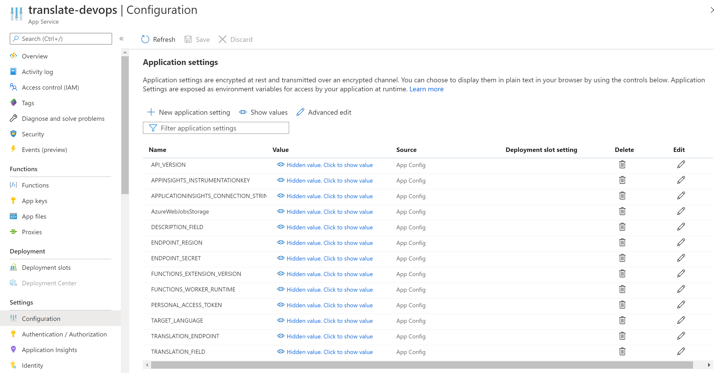

# Azure DevOps - Automated ticket translator

## The Challenge

**Internationally operating teams** and service desks often **struggle with language barriers**, especially when using ticket systems.

The translation of tickets and messages can be **time-consuming** (copy and paste the text into the browser) and **costly** (professional translation services). Furthermore, the mileage may vary when comparing the **quality** of different translation services, and **domain-specific terminology** makes translation even more difficult. To make things more complicated they probably **do not want their confidential information translated by public web services**.

These teams need an **affordable,** **high-quality**, and **compliant** solution.

## The Solution

This repository contains a **simple step-by-step instruction** and **code** for **your own DevOps Ticket Translation Solution**.


Using **Azure Cognitive Services** and **Azure Functions**, this solution is **very affordable and easy to implement**. All you need is an Azure Subscription and - of course - Azure DevOps.


The Cognitive Services Translator uses Microsoft's **high-quality neural translation models**, offering translations between **more than 60 languages** and also the possibility to **train your [Custom Translator](https://docs.microsoft.com/en-us/azure/cognitive-services/translator/translator-info-overview#language-customization) with domain-specific terminology**.

Last but not least, as both Azure Functions and Cognitive Services are **stateless and certified** (functions | [translator](https://www.microsoft.com/en-us/translator/business/notrace/#compliance)), and due to the Translator's **[no-trace](https://www.microsoft.com/en-us/translator/business/notrace/) guarantee,** this solution will certainly **comply with your company and state regulations**.

### A word about cost

Using pay-as-you-go services might cause some unease as the monthly bill becomes unpredictable. The worry is unfounded!

As long as you stick to standard language models and **stay below 1-2 thousand(!) translations per month** (at 1000 characters per ticket) **you don't pay a cent!** (or any currency you prefer).

The Cognitive Services Translator offers a **[free tier](https://azure.microsoft.com/en-us/pricing/details/cognitive-services/translator/)** (2 million characters/month included). The Azure Functions consumption plan (pay as you go) also offers a **monthly free grant of 1 million requests and 400,000 GB-s resource consumption**.

In case you want customized translations or translate larger ticket volumes, both Functions and Custom Translator are **quite inexpensive** (see: [Translator](https://azure.microsoft.com/en-us/pricing/details/cognitive-services/translator/) | [Functions](https://azure.microsoft.com/en-us/pricing/details/functions/)).

# Step-by-step instruction

_Enough marketing - let's get busy ..._

By the way, the documentation for DevOps, Functions, and Cognitive Services is very detailed and well maintained. As the services and workflows might change in the future, we refer to the step-by-step guides for each service.

### Requirements

All we need to implement our solution are

- **Azure DevOps** with sufficient rights to _edit tickets_, create _Personal Access Tokens_ and add _custom fields_ to your tickets

and an

- **Azure Subscription** and sufficient rights to create resources.

### Step 1: Azure DevOps

In Azure DevOps, you will want to add a custom field as your translation target ("Translated Description") and create a Personal Access Token (PAT).

#### Add a custom field

We want to add a new custom field to our Tasks. When following the guide below make sure to add a **Text (multiple lines)** field called "**Translated Description**", otherwise you will need to do some adjustments later on: https://docs.microsoft.com/en-us/azure/devops/organizations/settings/work/add-custom-field

#### Creating a Personal Access Token (PAT)

A Personal Access Token will allow our Translation service to access our Projects and add translations to our Tickets. Please keep in mind, that the translation service will only be able to edit projects, that you have access to.

This guide explains how to create a PAT: https://docs.microsoft.com/en-us/azure/devops/organizations/accounts/use-personal-access-tokens-to-authenticate

**Make sure to keep your PAT as you will need it later.**

### Step 2: Cognitive Services

#### Create a Cognitive Services Translator

We will need a Cognitive Services Translator resource, this guide explains how to create one: https://docs.microsoft.com/en-us/azure/cognitive-services/translator/translator-how-to-signup

When creating a resource

- you may **choose a free resource** (if 2M chars/months suffice and there is no other F1 resource in your subscription)

and

- **pick any region** that suits your needs (consider for example GDPR compliance or minimizing the distance between resources).

Once your Translator Resource is deployed, go to **Keys and Endpoint**. You will need one of the keys, the endpoint, and the location, so keep your browser tab open.


### Step 3: Azure Function

The Azure Function is our serverless compute, that receives a request from Azure DevOps, parses the Work Item information, translates the description and updates the Work Item. 

When deploying the function app, make sure to choose a consumption plan which scales better and is cheaper for our scenario. 

We provide both C# and Python code, so feel free to choose the language you prefer. 

#### Create a Function App

These guides explain how to create your first function from [Visual Studio](https://docs.microsoft.com/en-us/azure/azure-functions/functions-create-your-first-function-visual-studio), [Visual Studio Code](https://docs.microsoft.com/en-us/azure/azure-functions/functions-create-first-function-vs-code), and [the command-line interface](https://docs.microsoft.com/en-us/azure/azure-functions/functions-create-first-azure-function-azure-cli). We plan to later add ARM templates for easy deployment. 

Now we'll need to add our code. Follow either the C# or Python section.

##### C#

*TBD*

##### Python 3.8+

Simply add the files from the python directory and publish the **parse-ticket** function as described.

If you want to debug, make sure to add environment variables (see below) by replacing your local.settings.json with the [example file](python/example_local.settings.json) we provided and updating the fields (see the section on Function App Setting below).

```json
{
 "IsEncrypted": false,
 "Values": {
  "FUNCTIONS_WORKER_RUNTIME": "python",
  "TRANSLATION_ENDPOINT": "https://api-eur.cognitive.microsofttranslator.com/",
  "ENDPOINT_SECRET": "SOMEVERYLONGSTRING",
  "ENDPOINT_REGION": "westeurope",
  "PERSONAL_ACCESS_TOKEN": "ADDYOURPATHERE",
  "DESCRIPTION_FIELD": "System.Description",
  "TRANSLATION_FIELD": "Custom.Translateddescription",
  "TARGET_LANGUAGE": "en",
  "API_VERSION": "3.0"
 }
}
```

#### Function App Settings

We use environment variables to configure our app. The following guide explains how to add function app settings: https://docs.microsoft.com/en-us/azure/azure-functions/functions-how-to-use-azure-function-app-settings



You will need to add the following environment variables:

- "**TARGET_LANGUAGE**": A two-character string referring to the target language, for example, "**en**" for English. You can find a list of all code here: https://docs.microsoft.com/en-us/azure/cognitive-services/translator/language-support
- "**DESCRIPTION_FIELD**": The Work Item Field that we want to translate. The default Description field is "**System.Description**". Go here for more examples: https://docs.microsoft.com/en-us/azure/devops/boards/work-items/guidance/work-item-field
- "**TRANSLATION_FIELD**": The Work Item Field that contains the translation. If you added the custom field ''Translated Description'' the identifier is "**Custom.Translateddescription**".
- "**PERSONAL_ACCESS_TOKEN**": The personal access token you created in Azure DevOps.

- "**TRANSLATION_ENDPOINT**": The translation endpoint of your cognitive service resource (see Keys and Endpoint).
- "**ENDPOINT_SECRET**": One of the keys for your cognitive service resource (see Keys and Endpoint)
- "**ENDPOINT_REGION**": The location of your cognitive service resource (see Keys and Endpoint), e.g. "westeurope"

### Step 4: Azure DevOps WebHook

We now have everything we need to translate our tickets. In Azure DevOps under **Project Settings > Service Hooks**, create a **new subscription**. Select **WebHook**, then **next**.


Chose "Work item updated" as the trigger, leave the rest at default values.


Our action will be sending the ticket to our Azure Function, so all we need is to add the function URL:


Test the connection. If the URL is correct and the function is running you should receive a success message and you can finish the WebHook.


#### Testing the translation

To test your new translation service, go to your Project **Boards > Work** items and create a new item. Add some description that you would like to translate, and hit "save" and observe your **Translated Description** field. The translation should appear within a few seconds (2-10s).

If no translation appears, it's time for debugging. Go to step 5.

### (optional) Step 5: Azure Function Live Monitoring

https://docs.microsoft.com/en-us/azure/azure-functions/functions-monitoring

### (optional) Step 6: Custom Translator

https://portal.customtranslator.azure.ai/

https://docs.microsoft.com/en-us/azure/cognitive-services/translator/custom-translator/how-to-create-project

## Troubleshooting

#### DevOps Webhook Documentation

https://docs.microsoft.com/en-us/azure/devops/service-hooks/services/webhooks?view=azure-devops

#### Azure Function Documentation

https://docs.microsoft.com/en-us/azure/azure-functions/

#### Cognitive Services Translator Documentation

https://docs.microsoft.com/en-us/azure/cognitive-services/translator/

#### Cognitive Services Custom Translator Documentation

https://docs.microsoft.com/en-us/azure/cognitive-services/translator/custom-translator/overview
